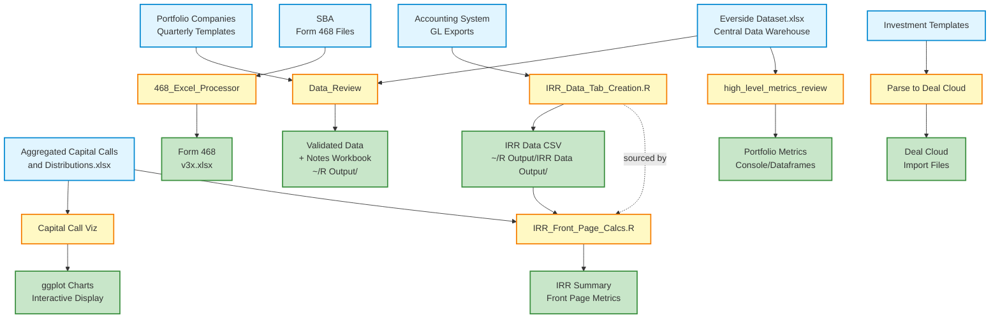

# Data Flows - Input/Output Map

**Purpose:** Quick reference for what files each script reads and writes
**Last Updated:** 2025-11-12

---

## Python Scripts

### 468_Excel_Processor.ipynb
- **Reads:**
  - `2024.06.30 - St. Cloud Fund III Form 468.xlsx` (3 sheets: S1Inv, S4Del, S12pc)
  - `Book1.xlsx` (output template)
- **Writes:**
  - `v1.xlsx` (intermediate file with aggregated S1Inv data)
  - `v3x.xlsx` (final processed output with all sheets)
- **Purpose:** SBA Form 468 regulatory data processing

---

### Parse investment template to deal cloud file.py
- **Reads:**
  - `Investment Template_Farragut v4.xlsx` (sheet: 'eFile', skiprows=7)
  - `deal_cloud_dataset_template.xlsx` (template)
- **Writes:**
  - `output_file_farragut_v4-v7.xlsx`
- **Purpose:** Convert investment templates to Deal Cloud CRM format

---

### Parse_investment_template_to_deal_cloud_file.ipynb
- **Reads:**
  - `Investment Template - Oxer.xlsx` (sheet: 'eFile', skiprows=7)
  - `deal_cloud_dataset_template_for_python.xlsx` (template)
- **Writes:**
  - `{output_file_path}.xlsx` (parameterized output)
- **Purpose:** Notebook version of Deal Cloud converter

---

### Parsing investment file into everside dataset template.py
- **Reads:**
  - Investment template files (parameterized)
- **Writes:**
  - Everside dataset format Excel files
- **Purpose:** Map investment data to Everside internal schema

---

### Champlain_Capital468.ipynb
- **Reads:**
  - Client-specific Form 468 files
- **Writes:**
  - `{updated_file_path}.xlsx`
  - `{csv_file_path}.csv`
- **Purpose:** Client-specific Form 468 processing

---

### Historic_Everside_Deal_Cloud_parsing.ipynb
- **Reads:**
  - Historical investment data files
- **Writes:**
  - `{output_file_path}.xlsx`
- **Purpose:** One-time historical data migration to Deal Cloud
- **Status:** Likely one-time use, not part of regular workflow

---

## R Scripts

### Capital_Call_Distribution_data.R
- **Reads:**
  - `~/R Data/Aggregated Capital Calls and Distributions.xlsx`
- **Writes:**
  - **None** (displays ggplot2 charts in R session)
- **Purpose:** Visualize capital call and distribution rates across 7 funds
- **Output Type:** Interactive plots (must save manually with ggsave if needed)

---

### Capital_For_Filtered_Funds.R
- **Reads:**
  - `~/R Data/Aggregated Capital Calls and Distributions.xlsx`
- **Writes:**
  - **None** (displays plots in R session)
- **Purpose:** Fund-specific capital analysis with filtering

---

### IRR_Data_Tab_Creation.R
- **Reads:**
  - `~/R Data/LTD Investment Transactions - {date}.xlsx` (GL transaction export)
  - Examples: "LTD Investment Transactions - 6.30.25 - Team Air update.xlsx"
- **Writes:**
  - `~/R Output/IRR Data Output/{fund}-{start_date}-IRR_data_tab_output.csv`
  - Example: "Fund IV-2025-04-01-IRR_data_tab_output.csv"
- **Purpose:** Process GL transactions into IRR calculation format
- **Functions Exported:**
  - `create_irr_data_tab(fund, start_date, gl_file_input, excel_flag)`
  - `install_and_library_packages(install_flag)`

---

### IRR_Front_Page_Calcs.R
- **Reads:**
  - `~/R Data/Everside Fund III IRR Model 3Q24.xlsx` (sheet: 'Data', startRow=4)
  - `~/R Data/Aggregated Capital Calls and Distributions.xlsx`
  - `~/R Data/Fund_Alias_Lookup.xlsx` (fund-specific sheets)
- **Writes:**
  - **None** (returns dataframes in R session)
- **Purpose:** Generate summary IRR metrics for investor report front pages
- **Dependencies:**
  - **SOURCES:** `~/R Data/IRR_Data_Tab_Creation.R` (line 53)
  - Calls: `create_irr_data_tab()` function

---

### Data_Review
- **Reads:**
  - `~/R Data/Everside Dataset.xlsx` (sheet: 'Everside Dataset')
  - `~/R Data/Quarterly Templates/{quarterly_template}.xlsx` (parameterized sheet name)
  - Example: "Boathouse III - Everside Quarterly Report Template (2Q24).xlsx"
- **Writes:**
  - `~/R Output/{table_name}-{as_of_date}_updated_template.xlsx` (validated data)
  - `~/R Output/{fund} - {table} Notes - {as_of_date}.xlsx` (validation notes workbook)
  - Examples:
    - "Boathouse_III-2024-06-30_updated_template.xlsx"
    - "Fund II - Boathouse_III Notes - 2024-06-30.xlsx"
- **Purpose:** Quarterly data validation with 18+ quality checks
- **Functions Exported:**
  - `ingest_data(quarterly_template, sheet_name)`
  - `data_cleanse(quarterly_file, table_name, as_of_date_input, update_denom_mill_flag)`
  - `create_comparison_data(...)`
  - `compare_data(...)` - Core validation engine
  - `full_cleansing_and_comparison(...)` - Orchestrator
  - `getEversideFund(table_name)`

---

### high_level_metrics_review
- **Reads:**
  - `~/R Data/Everside Dataset.xlsx` (sheets: 'Everside Dataset', 'IRR Dataset')
- **Writes:**
  - **None** (returns dataframes in R session)
- **Purpose:** Portfolio-level metric aggregation and reporting
- **Output Type:** Console output and in-memory dataframes

---

### radius_monthly_financials_data_pull
- **Reads:**
  - `~/R Data/Monthly Financials/{file_name}.xlsx` (multiple sheets, parameterized)
- **Writes:**
  - **None** (returns dataframe in R session)
- **Purpose:** Extract and process Radius Holdings monthly financial data
- **Functions Exported:**
  - `radius_monthly_financials_data_pull(file_name, sheet_name, time_period)`

---

### Risk_Rating_Function
- **Reads:**
  - Unknown (not fully analyzed - 29,084 lines)
- **Writes:**
  - Unknown
- **Purpose:** Portfolio company risk assessment algorithms
- **Status:** Function library, likely sourced by other scripts

---

## Key Data Files (Shared Resources)

### Everside Dataset.xlsx
- **Location:** `~/R Data/`
- **Used By:**
  - Data_Review (historical reference data)
  - high_level_metrics_review (primary data source)
- **Purpose:** Central data warehouse for portfolio company information
- **Sheets:**
  - 'Everside Dataset' - Portfolio company details
  - 'IRR Dataset' - IRR calculation data

---

### Aggregated Capital Calls and Distributions.xlsx
- **Location:** `~/R Data/`
- **Used By:**
  - Capital_Call_Distribution_data.R
  - Capital_For_Filtered_Funds.R
  - IRR_Front_Page_Calcs.R
- **Purpose:** Historical capital call and distribution activity across all funds
- **Contains:** Fund, entity, call_dist type, date, amount, cumulative metrics

---

### LTD Investment Transactions - {date}.xlsx
- **Location:** `~/R Data/`
- **Used By:**
  - IRR_Data_Tab_Creation.R
- **Purpose:** General ledger transaction exports
- **Source:** Accounting system (QuickBooks, NetSuite, or similar)
- **Contains:** GL transactions with entity, position, transaction type, amounts, batch IDs

---

### Quarterly Templates/*.xlsx
- **Location:** `~/R Data/Quarterly Templates/`
- **Used By:**
  - Data_Review
- **Purpose:** Quarterly portfolio company data submissions for validation
- **Examples:**
  - "Boathouse III - Everside Quarterly Report Template (2Q24).xlsx"
- **Contains:** Current quarter portfolio metrics, ESG data, financial performance

---

## Major Data Flows



---

## Processing Chains by Business Process

### 1. SBA Regulatory Reporting
```
Form 468 Excel Files
  ↓
468_Excel_Processor.ipynb
  ↓
v3x.xlsx (standardized format)
  ↓
[Manual review / SBIC submission]
```

---

### 2. Deal Cloud CRM Integration
```
Investment Templates (eFile sheets)
  ↓
Parse investment template to deal cloud file.py
  ↓
Deal Cloud import files
  ↓
[Upload to Deal Cloud CRM]
```

---

### 3. IRR Calculation & Reporting
```
GL Transaction Exports
  ↓
IRR_Data_Tab_Creation.R
  ↓
IRR Data CSV (18-column format)
  ↓
IRR_Front_Page_Calcs.R (sources IRR_Data_Tab_Creation.R)
  ↓
Summary IRR metrics for investor reports
```

---

### 4. Quarterly Data Validation
```
Quarterly Templates (Portfolio companies)
  +
Everside Dataset.xlsx (Historical reference)
  ↓
Data_Review (18 validation checks)
  ↓
Validated Template + Notes Workbook
  ↓
[Manual review → SBIC quarterly filing]
```

---

### 5. Capital Call/Distribution Analysis
```
Aggregated Capital Calls and Distributions.xlsx
  ↓
Capital_Call_Distribution_data.R
  ↓
Interactive ggplot2 charts
  ↓
[LP reporting / Investment committee materials]
```

---

### 6. Portfolio-Level Metrics
```
Everside Dataset.xlsx (2 sheets)
  ↓
high_level_metrics_review
  ↓
Portfolio-wide metrics (console output)
  ↓
[Management reporting]
```

---

## File Location Summary

### Input Locations
- **~/R Data/** - All R script inputs (Excel files, CSVs)
  - Subdirs: `Quarterly Templates/`, `Monthly Financials/`
- **Current directory** - Python script inputs (Form 468, investment templates)

### Output Locations
- **~/R Output/** - General R outputs (validated data, notes)
  - Subdir: `IRR Data Output/` - IRR calculation CSVs
- **Current directory** - Python script outputs (v1.xlsx, v3x.xlsx, Deal Cloud files)

### No File Output (Display Only)
- Capital_Call_Distribution_data.R (ggplot2 charts)
- Capital_For_Filtered_Funds.R (ggplot2 charts)
- high_level_metrics_review (console/dataframes)
- radius_monthly_financials_data_pull (dataframes)

---

## Script Dependencies

### Direct Code Dependencies (source/import)
- **IRR_Front_Page_Calcs.R** → sources → **IRR_Data_Tab_Creation.R** (line 53)

### Data Dependencies (output consumed as input)
- **IRR_Data_Tab_Creation.R** output CSV → **IRR_Front_Page_Calcs.R** (indirect, via function call)

### Shared Data Resources (multiple readers)
- **Everside Dataset.xlsx** ← Data_Review, high_level_metrics_review
- **Aggregated Capital Calls and Distributions.xlsx** ← 3 scripts (capital viz + IRR front page)

---

## Orphaned/Standalone Files

### Scripts with No Clear Integration
- **Historic_Everside_Deal_Cloud_parsing.ipynb** - One-time migration (not part of regular workflow)
- **Risk_Rating_Function** - Not referenced in analyzed scripts (may be sourced elsewhere)

---

## Quick Reference: Where Are Outputs Written?

| Output Type | Location | Scripts |
|------------|----------|---------|
| IRR Data CSVs | `~/R Output/IRR Data Output/` | IRR_Data_Tab_Creation.R |
| Validated Quarterly Data | `~/R Output/` | Data_Review |
| Validation Notes | `~/R Output/` | Data_Review |
| Form 468 Processed | Current directory (v1.xlsx, v3x.xlsx) | 468_Excel_Processor |
| Deal Cloud Imports | Current directory | Parse to Deal Cloud scripts |
| Capital Call Charts | R Session (not saved) | Capital viz scripts |
| Portfolio Metrics | Console/R Session | high_level_metrics_review |

---

**End of Data Flows Documentation**

**Total Scripts Documented:** 14 scripts (4 Python + 9 R + 1 notebook)
**Key Shared Resources:** 4 major data files (Everside Dataset, Capital Calls, GL Transactions, Quarterly Templates)
**Processing Chains:** 6 distinct business workflows identified
